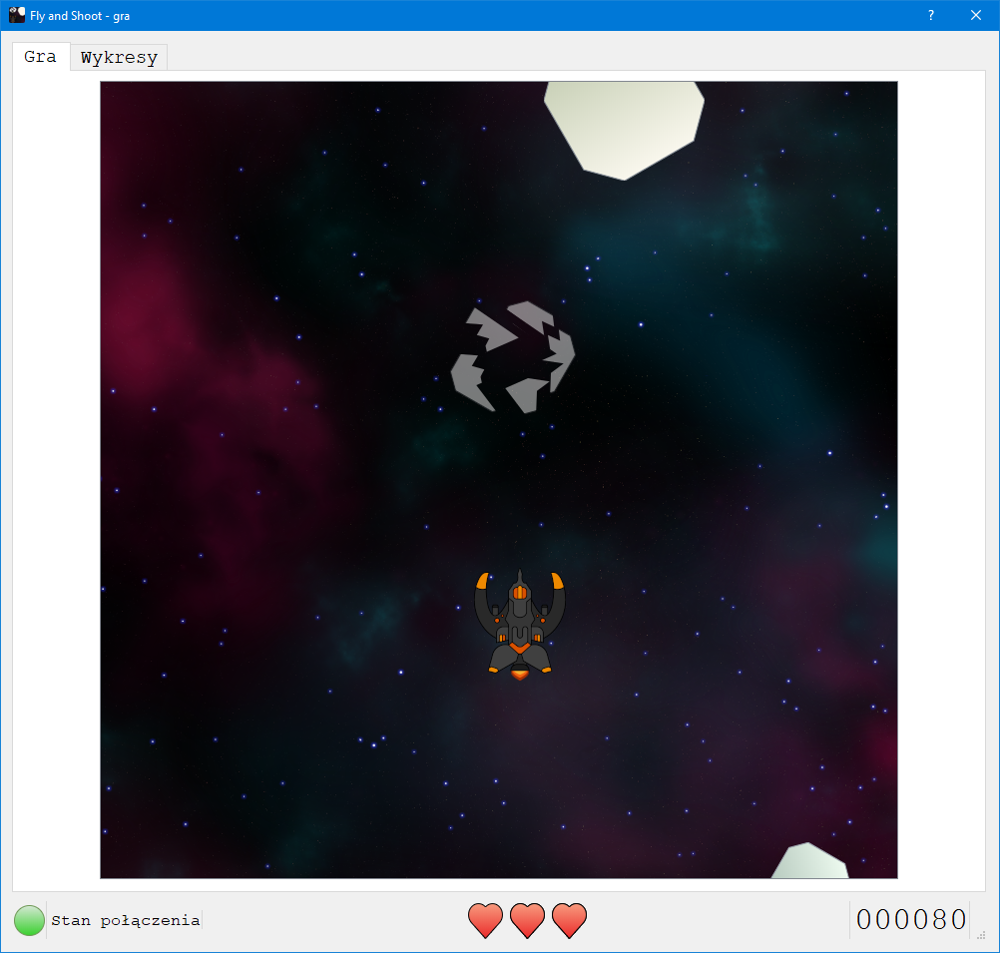
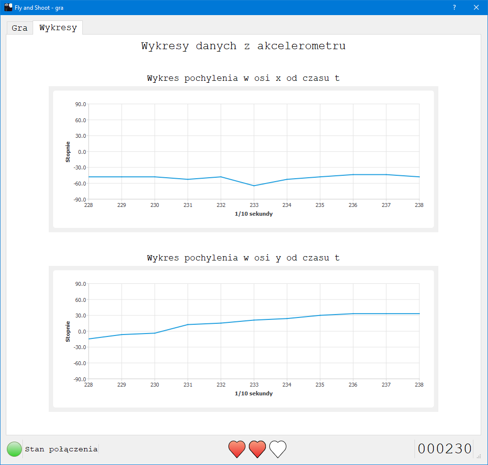
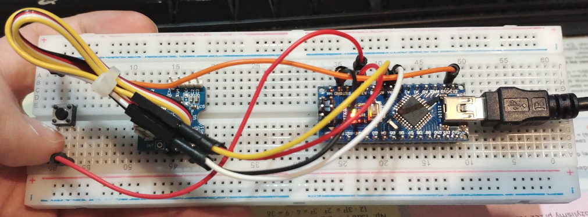
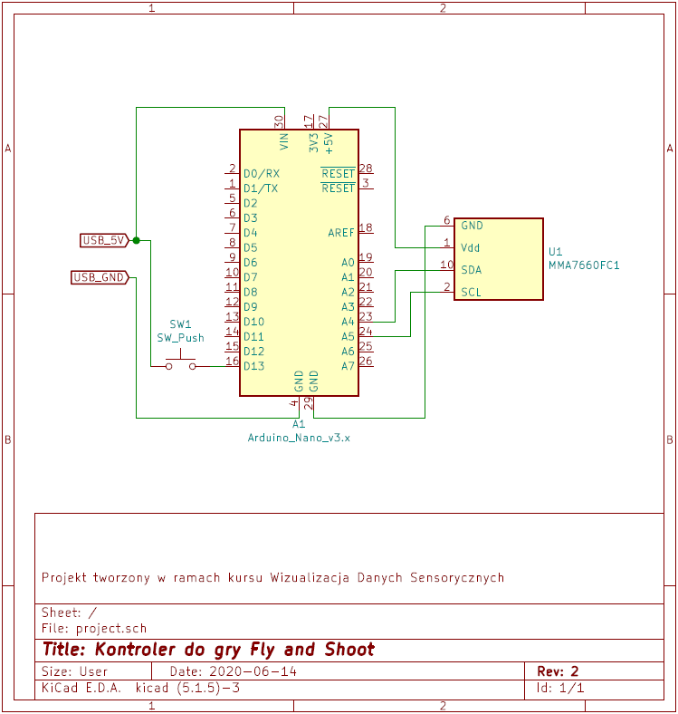

# FlyAndShoot
Game with a graphical user interface – controlled by a self‑made dedicated gamepad with accelerometer responsive to gestures.

[Polish version of readme](/README_pl.md)

---

## Project description
The main goal of the project was to develop an graphical application which will w=visualise data received from a sensor in an interesting way.
The used data comes from an *MMA7660FC* accelerometer which was connected with *Arduino Nano v3* microcontroller. The visualisation has a form of an arcade game, where the player can control a spaceship using a gamepad which reacts to gestures. The main goal of the game is to avoid or destroy approaching meteorites. Additionaly the application shows diagrams of received data.

---

## Results
### Gameplay

### Data diagrams

### Gamepad

### Electric diagram

